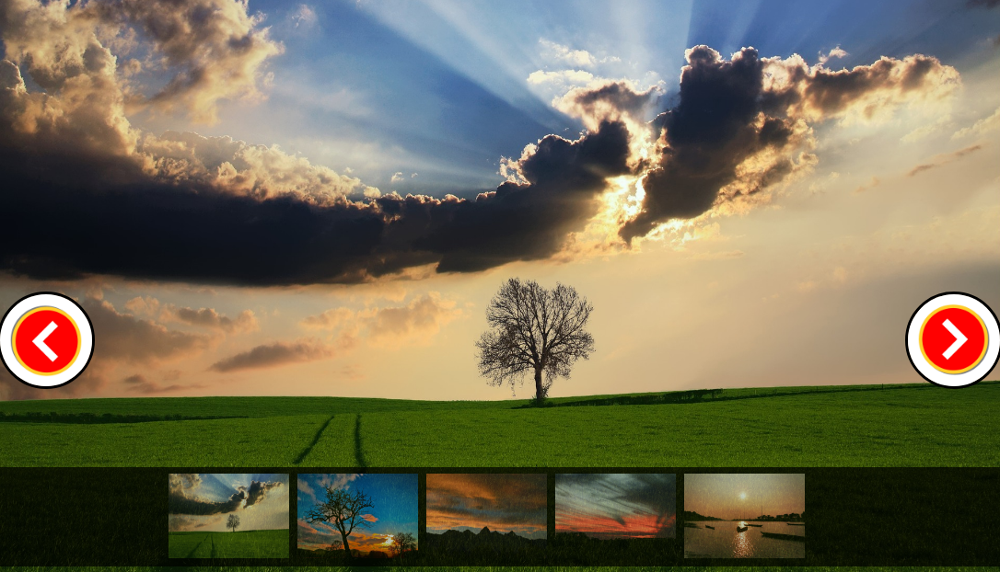

# Projects

## Slideshow

  
[View project](https://apooravc.github.io/misc.works/works/slideshow/index.html)

## imGet - Gallery search

  
[View project](https://apooravc.github.io/misc.works/works/imGET/index.html)

## Random Quote Generator

  
[View project](https://apooravc.github.io/misc.works/works/QuoteGen/index.html)

## Installing

1. Clone the repository [Misc.-works](https://github.com/apooravc/misc.works).
2. Open works/project-name/index.html in the browser to view the respective project.

